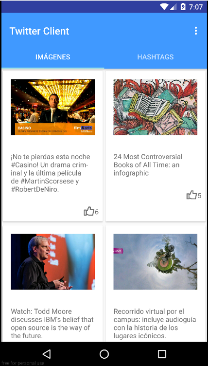

# Android Twitter Client

Este es un cliente sencillo de Twitter que obtiene las imágenes y los hashtag con más "me gusta" para el usuario autenticado.



Para que funcione, se debe crear una aplicación en [Twitter](https://dev.twitter.com/) para obtener un TWITTER_KEY y un TWITTER_SECRET. Adicional es necesario integrar [Fabric](https://fabric.io/kits/android/twitterkit/install) para obtener un FABRIC_API_KEY. Las llaves generadas se deben agregar en un archivo __gradle.properties__, dentro de la raíz del proyecto.

```
TWITTER_KEY= "oF5mDD......"
TWITTER_SECRET = "ICggXE3vkl......"
FABRIC_API_KEY = "efcfe......"
```
NOTA: Para la autenticación, es necesario que la opción _Enable Callback Locking_ esté desactivada en la configuración de la aplicación en Twitter

## Estructura

La capa de presentación se organiza utilizando [MVP](http://antonioleiva.com/mvp-android) + [Clean](https://8thlight.com/blog/uncle-bob/2012/08/13/the-clean-architecture.html).

Las imagenes de perfil de los usuarios se obtienen de Gravatar utilizando la librería [Glide](https://github.com/bumptech/glide).

Los eventos se envían entre las capas de la arquitectura usando [EvenBus] (https://github.com/greenrobot/EventBus).

Las dependencias se proveen utilizando el inyector de dependencias [Dagger2] (https://github.com/google/dagger)

TODO:
* Pruebas

## Pantallas:

* [Login](./screenshots/1-login.png)
* [Tab de imágenes](./screenshots/2-images.png)
* [Tab de hashtags](./screenshots/3-hashtags.png)
